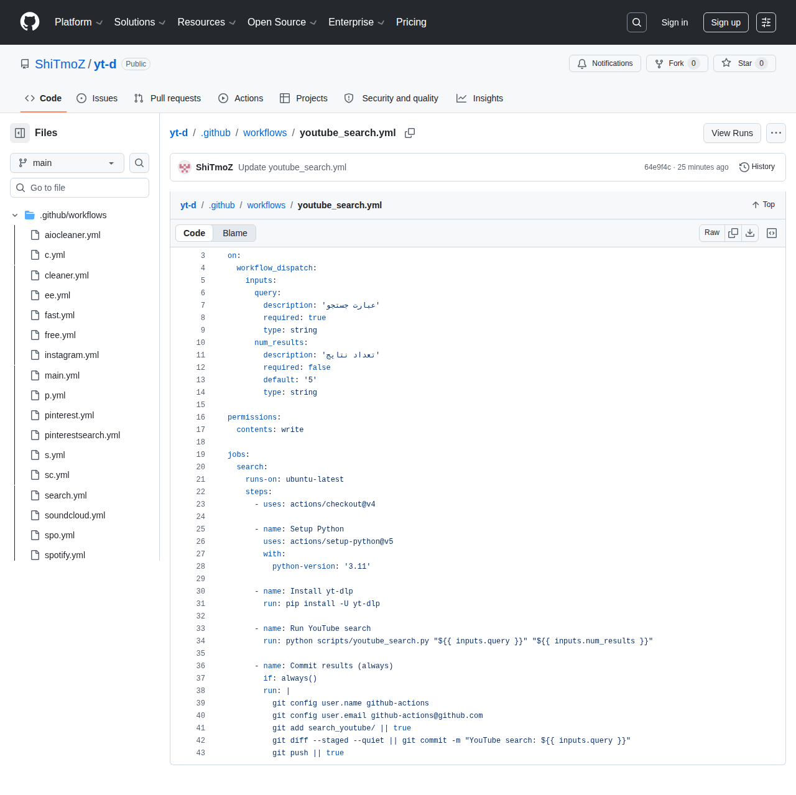

# Visited: https://github.com/ShiTmoZ/yt-d/blob/main/.github/workflows/youtube_search.yml
**Time:** Mon May 25 16:05:07 UTC 2026

## Favicon

## Screenshot

## Raw HTML
[page.html](./page.html)

## Downloaded Media (5 files)
## Downloaded Media Files

## Other Links
- [#start-of-content](#start-of-content)
- [/](/)
- [/ShiTmoZ](/ShiTmoZ)
- [/ShiTmoZ/yt-d](/ShiTmoZ/yt-d)
- [/ShiTmoZ/yt-d/actions](/ShiTmoZ/yt-d/actions)
- [/ShiTmoZ/yt-d/actions/workflows/youtube_search.yml](/ShiTmoZ/yt-d/actions/workflows/youtube_search.yml)
- [/ShiTmoZ/yt-d/commits/main/.github/workflows/youtube_search.yml](/ShiTmoZ/yt-d/commits/main/.github/workflows/youtube_search.yml)
- [/ShiTmoZ/yt-d/issues](/ShiTmoZ/yt-d/issues)
- [/ShiTmoZ/yt-d/projects](/ShiTmoZ/yt-d/projects)
- [/ShiTmoZ/yt-d/pulls](/ShiTmoZ/yt-d/pulls)
- [/ShiTmoZ/yt-d/pulse](/ShiTmoZ/yt-d/pulse)
- [/ShiTmoZ/yt-d/security](/ShiTmoZ/yt-d/security)
- [/ShiTmoZ/yt-d/tree/main](/ShiTmoZ/yt-d/tree/main)
- [/ShiTmoZ/yt-d/tree/main/.github](/ShiTmoZ/yt-d/tree/main/.github)
- [/ShiTmoZ/yt-d/tree/main/.github/workflows](/ShiTmoZ/yt-d/tree/main/.github/workflows)
- [/login?return_to=%2FShiTmoZ%2Fyt-d](/login?return_to=%2FShiTmoZ%2Fyt-d)
- [/login?return_to=https%3A%2F%2Fgithub.com%2FShiTmoZ%2Fyt-d%2Fblob%2Fmain%2F.github%2Fworkflows%2Fyoutube_search.yml](/login?return_to=https%3A%2F%2Fgithub.com%2FShiTmoZ%2Fyt-d%2Fblob%2Fmain%2F.github%2Fworkflows%2Fyoutube_search.yml)
- [/manifest.json](/manifest.json)
- [/opensearch.xml](/opensearch.xml)
- [/search/custom_scopes/check_name](/search/custom_scopes/check_name)
- [/signup?ref_cta=Sign+up&amp;ref_loc=header+logged+out&amp;ref_page=%2F%3Cuser-name%3E%2F%3Crepo-name%3E%2Fblob%2Fshow&amp;source=header-repo&amp;source_repo=ShiTmoZ%2Fyt-d](/signup?ref_cta=Sign+up&amp;ref_loc=header+logged+out&amp;ref_page=%2F%3Cuser-name%3E%2F%3Crepo-name%3E%2Fblob%2Fshow&amp;source=header-repo&amp;source_repo=ShiTmoZ%2Fyt-d)
- [https://archiveprogram.github.com](https://archiveprogram.github.com)
- [https://avatars.githubusercontent.com](https://avatars.githubusercontent.com)
- [https://docs.github.com](https://docs.github.com)
- [https://docs.github.com/](https://docs.github.com/)
- [https://docs.github.com/search-github/github-code-search/understanding-github-code-search-syntax](https://docs.github.com/search-github/github-code-search/understanding-github-code-search-syntax)
- [https://docs.github.com/site-policy/github-terms/github-terms-of-service](https://docs.github.com/site-policy/github-terms/github-terms-of-service)
- [https://docs.github.com/site-policy/privacy-policies/github-privacy-statement](https://docs.github.com/site-policy/privacy-policies/github-privacy-statement)
- [https://github-cloud.s3.amazonaws.com](https://github-cloud.s3.amazonaws.com)
- [https://github.blog](https://github.blog)
- [https://github.blog/changelog](https://github.blog/changelog)
- [https://github.com](https://github.com)
- [https://github.com/ShiTmoZ/yt-d/raw/refs/heads/main/.github/workflows/youtube_search.yml](https://github.com/ShiTmoZ/yt-d/raw/refs/heads/main/.github/workflows/youtube_search.yml)
- [https://github.com/accelerator](https://github.com/accelerator)
- [https://github.com/collections](https://github.com/collections)
- [https://github.com/customer-stories](https://github.com/customer-stories)
- [https://github.com/enterprise](https://github.com/enterprise)
- [https://github.com/enterprise/startups](https://github.com/enterprise/startups)
- [https://github.com/features](https://github.com/features)
- [https://github.com/features/actions](https://github.com/features/actions)
- [https://github.com/features/code-review](https://github.com/features/code-review)
- [https://github.com/features/codespaces](https://github.com/features/codespaces)
- [https://github.com/features/copilot](https://github.com/features/copilot)
- [https://github.com/features/copilot/copilot-business](https://github.com/features/copilot/copilot-business)
- [https://github.com/features/issues](https://github.com/features/issues)
- [https://github.com/features/models](https://github.com/features/models)
- [https://github.com/features/spark](https://github.com/features/spark)
- [https://github.com/marketplace](https://github.com/marketplace)
- [https://github.com/mcp](https://github.com/mcp)
- [https://github.com/orgs/community/discussions](https://github.com/orgs/community/discussions)

## Stats
- Links: 216
- Media: 5
