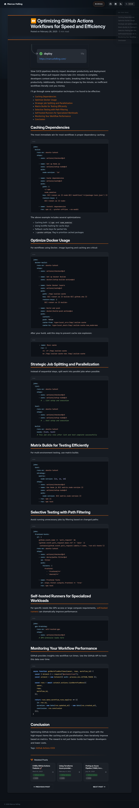

# Visited: https://marcusfelling.com/blog/2025/optimizing-github-actions-workflows-for-speed
**Time:** Mon May 25 18:51:48 UTC 2026

## Favicon

## Screenshot

## Raw HTML
[page.html](./page.html)

## Downloaded Media (3 files)
## Downloaded Media Files

- [1779735107_favicon.ico](./media/1779735107_favicon.ico) (14 KB)

## Other Links
- [#caching-dependencies](#caching-dependencies)
- [#conclusion](#conclusion)
- [#main-content](#main-content)
- [#matrix-builds-for-testing-efficiently](#matrix-builds-for-testing-efficiently)
- [#monitoring-your-workflow-performance](#monitoring-your-workflow-performance)
- [#optimize-docker-usage](#optimize-docker-usage)
- [#selective-testing-with-path-filtering](#selective-testing-with-path-filtering)
- [#self-hosted-runners-for-specialized-workloads](#self-hosted-runners-for-specialized-workloads)
- [#strategic-job-splitting-and-parallelization](#strategic-job-splitting-and-parallelization)
- [/](/)
- [/archives](/archives)
- [/archives#cicd](/archives#cicd)
- [/archives#github-actions](/archives#github-actions)
- [/assets/css/blog.css](/assets/css/blog.css)
- [/assets/js/command-palette.js](/assets/js/command-palette.js)
- [/assets/js/google-analytics.js](/assets/js/google-analytics.js)
- [/assets/js/post-toc.js](/assets/js/post-toc.js)
- [/assets/js/scroll-to-top.js](/assets/js/scroll-to-top.js)
- [/assets/js/search.js](/assets/js/search.js)
- [/blog/2020/porting-an-azure-pipeline-yaml-to-a-github-action/](/blog/2020/porting-an-azure-pipeline-yaml-to-a-github-action/)
- [/blog/2021/using-terraforms-azure-provider-azurerm-with-github-actions-and-terraform-cloud/](/blog/2021/using-terraforms-azure-provider-azurerm-with-github-actions-and-terraform-cloud/)
- [/blog/2023/6-nifty-github-actions-features/](/blog/2023/6-nifty-github-actions-features/)
- [/blog/2025/vpn-toggle-vscode-extension](/blog/2025/vpn-toggle-vscode-extension)
- [/blog/2026/three-day-hackathon-shipping-ai-agent-mvps](/blog/2026/three-day-hackathon-shipping-ai-agent-mvps)
- [/feed.xml](/feed.xml)
- [https://cdn.jsdelivr.net/npm/popper.js@1.16.0/dist/umd/popper.min.js](https://cdn.jsdelivr.net/npm/popper.js@1.16.0/dist/umd/popper.min.js)
- [https://cdnjs.cloudflare.com/ajax/libs/font-awesome/6.5.2/css/all.min.css](https://cdnjs.cloudflare.com/ajax/libs/font-awesome/6.5.2/css/all.min.css)
- [https://code.jquery.com/jquery-3.5.1.slim.min.js](https://code.jquery.com/jquery-3.5.1.slim.min.js)
- [https://docs.github.com/en/actions/hosting-your-own-runners/managing-self-hosted-runners/about-self-hosted-runners](https://docs.github.com/en/actions/hosting-your-own-runners/managing-self-hosted-runners/about-self-hosted-runners)
- [https://fonts.googleapis.com](https://fonts.googleapis.com)
- [https://fonts.googleapis.com/css2?family=Inter:ital,opsz,wght@0,14..32,400;0,14..32,500;0,14..32,600;0,14..32,700;0,14..32,800;1,14..32,400&family=JetBrains+Mono:wght@400;500&display=swap](https://fonts.googleapis.com/css2?family=Inter:ital,opsz,wght@0,14..32,400;0,14..32,500;0,14..32,600;0,14..32,700;0,14..32,800;1,14..32,400&family=JetBrains+Mono:wght@400;500&display=swap)
- [https://fonts.gstatic.com](https://fonts.gstatic.com)
- [https://github.com/marcusfelling](https://github.com/marcusfelling)
- [https://marcusfelling.com/blog/2025/optimizing-github-actions-workflows-for-speed](https://marcusfelling.com/blog/2025/optimizing-github-actions-workflows-for-speed)
- [https://stackpath.bootstrapcdn.com/bootstrap/4.4.1/css/bootstrap.min.css](https://stackpath.bootstrapcdn.com/bootstrap/4.4.1/css/bootstrap.min.css)
- [https://stackpath.bootstrapcdn.com/bootstrap/4.4.1/js/bootstrap.min.js](https://stackpath.bootstrapcdn.com/bootstrap/4.4.1/js/bootstrap.min.js)
- [https://www.linkedin.com/in/marcusfelling](https://www.linkedin.com/in/marcusfelling)

## Stats
- Links: 39
- Media: 3
